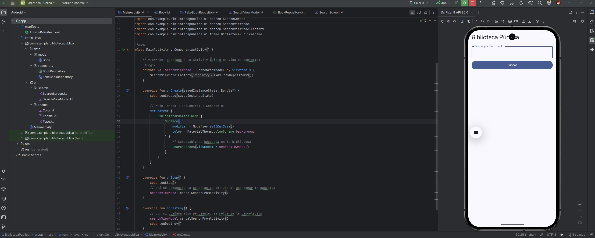
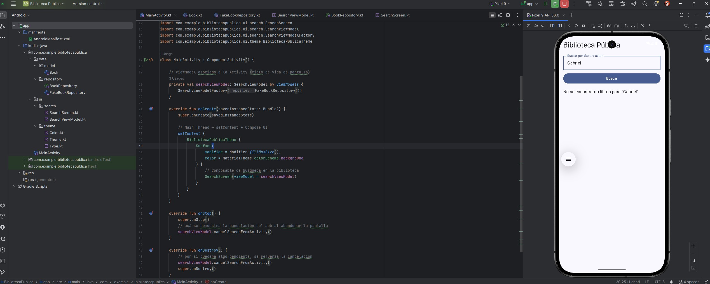
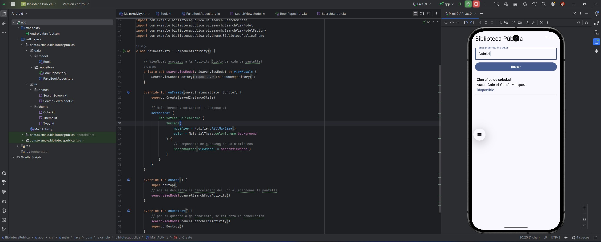
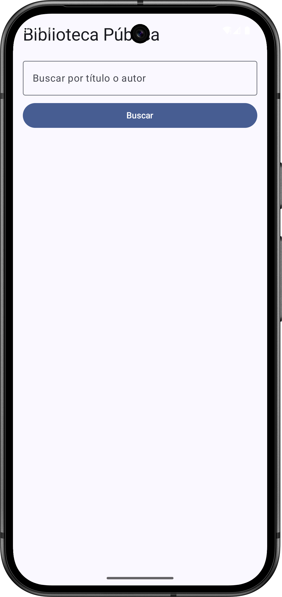
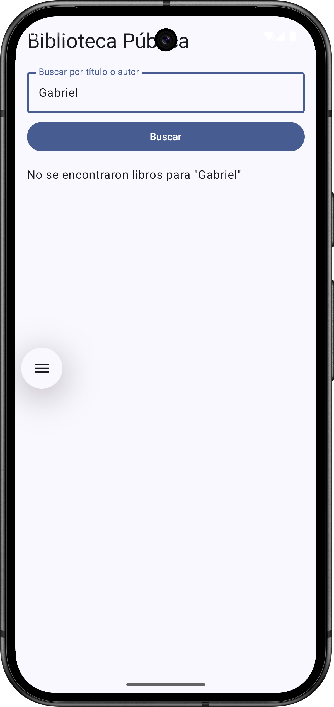
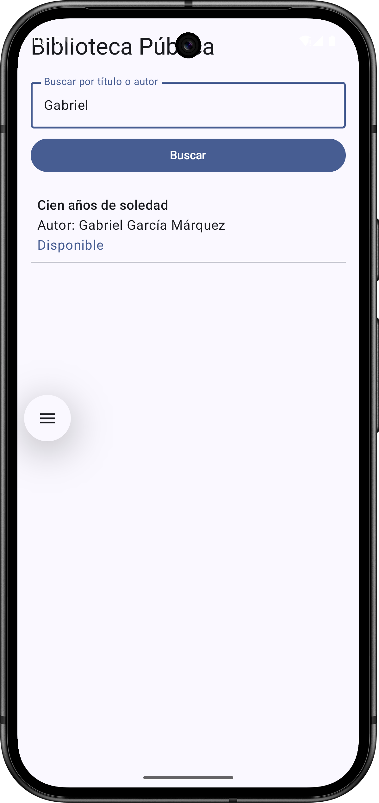

**_<h1 align="center">:vulcan_salute: Proyecto Realizado con Andoid Studio :computer:</h1>_**

**<h3>:blue_book: Contexto:</h3>**

<p>Estás La municipalidad de tu ciudad quiere modernizar el acceso a su biblioteca pública. Te encarga el desarrollo de una app donde los usuarios puedan buscar libros por título o autor y consultar su disponibilidad.</p>
<p>El principal requerimiento es que las consultas al servidor (o base de datos) no bloqueen la aplicación ni la interfaz gráfica, ya que  una experiencia fluida incluso si el servidor tarda en responder.</p>
<p>La solución debe usar Kotlin Coroutines para la ejecución de las tareas en segundo plano y debe respetar las buenas prácticas de manejo de hilos y concurrencia.</p>

**<h3>:orange_book: Requerimientos:</h3>**

<p>Se solicita que desarrolle un conjunto de sentencias SQL que permita pasar desde el modelo de datos original al modelo de datos actualizado, utilizando las consultas vistas en la clase. No es necesario que sea solo una consulta, lo puede hacer en base a una transacción que tenga un inicio y fin determinados, con consultas independientes, pero que forman parte de un conjunto mayor de instrucciones.</p>
<ul>
    <li>Permita al usuario ingresar palabras clave y realizar búsquedas</li>
    <li>Realice la consulta de forma <b>asíncrona</b></li>
    <li>Muestre los resultados en una lista sin afectar la experiencia de uso</li>
    <li>Maneje el ciclo de vida de la Corrutina adecuadamente</li>
    <li>Permita la <b>cancelación</b> de la operación si el usuario abandona la pantalla</li>
</ul>

**<h3>:orange_book: Requisitos Técnicos:</h3>**

<p>Uso obligatorio de <b>Kotlin Coroutines</b> y las funciones:</p>
<ul>
    <li>launch</li>
    <li>async</li>
    <li>withContext</li>
    <li>await</li>
</ul>
<p>Demostración de la separación entre <b>Main Thread</b> y <b>Main Thread</b></p>
<p>Simulación de una API REST con delay() o uso de un archivo JSON local</p>
<p>Uso de <b>ProgressBar o Loading </b> mientras se realiza la búsqueda</p>
<p>Manejo de <b>Job</b> y su cancelación en onDestroy() o onStop()</p>
<p>Documentación en el código explicando el uso de cada hilo y cada corrutina</p>

**<h3>📁 Estructura del Proyecto Android:</h3>**

```Android
📘 README.md
📁 app/src/main/
├── 🟧 AndroidManifest.xml
├── 📁 java
│   ├── 📁 com.example.bibliotecapublica
│   │   ├── 📁 data
│   │   │   ├──📁 components
│   │   │   │   └── 🟦 Book.kt
│   │   │   └──📁 components
│   │   │       ├── 🟦 BookRepository.kt
│   │   │       └── 🟦 FakeBookRepository.kt
│   │   ├── 📁 navigation
│   │   │    └── 🟦 AppNavigation.kt
│   │   ├── 📁 ui
│   │   │   ├── 📁 search
│   │   │   │    ├── 🟦 SearchScreen.kt
│   │   │   │    └── 🟦 SearchViewModel.kt
│   │   │   └── 📁 theme
│   │   │        ├── 🟦 Color.kt
│   │   │        ├── 🟦 Theme.kt
│   │   │        └── 🟦 Type.kt
│   │   └── 🟦 MainActivity.kt
│   ├── 📁 com.example.bibliotecapublica (android Test)
│   │   └── 🟦 ExampleInstrumentedTest.java
│   └── 📁 com.example.bibliotecapublica (test)
│       └── 🟦 ExampleUnitTest.java
├── 📁 java (generated)
├── 📁 res
│   ├── 📁 drawable
│   │   ├── 🖼️ biblioteca_1.png
│   │   ├── 🖼️ biblioteca_2.png
│   │   ├── 🖼️ biblioteca_3.png
│   │   ├── 🖼️ biblioteca_4.png
│   │   ├── 🖼️ biblioteca_5.png
│   │   ├── 🖼️ biblioteca_6.png
│   │   ├── 🖼️ biblioteca_publica_1.jpg
│   │   ├── 🖼️ biblioteca_publica_2.jpg
│   │   ├── 🖼️ biblioteca_publica_3.jpg
│   │   ├── 🖼️ biblioteca_publica_4.jpg
│   │   ├── 🟧 ic_launcher_background.xml
│   │   └── 🟧 ic_launcher_foreground.xml
│   ├── 📁 layout
│   │   └── 🟧 activity_main.xml
│   ├── 📁 mipmap
│   │   ├── 📁 ic_launcher
│   │   └── 📁 ic_launcher_round
│   ├── 📁 values
│   │   ├── 📁themes
│   │   │   ├── 🟧 themes.xml
│   │   │   └── 🟧 themes.xml (night)
│   │   ├── 🟧 colors.xml
│   │   └── 🟧 strings.xml
│   └── 📁 xml
📁 Gradle Scripts
├── 🟦 build.gradle.kts (Project: BibliotecaPublica)
├── 🟦 build.gradle.kts (Module: app)
├── 🟦 proguard-rules.pro (ProGuard rules for ":app")
├── 🟦 gradle.properties (Project properties)
├── 🟦 gradle-wrapper.properties (Gradle Version)
├── 🟦 libs.versions.toml (version Catalog "libs")
├── 🟦 local.properties (SDK Location)
└── 🟦 settings.gradle.kts (Project Settings)
```

**<h3>:book: Imagen general del proyecto:</h3>**

<table>
  <tr>
    <td align="center">
      <strong>Mostrando pantalla inicial</strong><br>
      
    </td>
    <td align="center">
      <strong>Ingresando datos</strong><br>
      
    </td>
  </tr>
  <tr>
    <td align="center">
      <strong>Mostrando tarea completa y tarea pendiente</strong><br>
      
    </td>
    <td align="center">
      <strong>Mostrando dos tareas y tarea eliminada</strong><br>
      
    </td>
  </tr>
</table>

**<h3>:book: Capturas de pantalla de la interfaz de usuario final:</h3>**

<table>
  <tr>
    <td align="center">
      <strong>Mostrando pantalla inicial</strong><br>
      
    </td>
    <td align="center">
      <strong>Ingresando datos</strong><br>
      
    </td>
    <td align="center">
      <strong>Mostrando tarea completa y tarea pendiente</strong><br>
      
    </td>
  </tr>
  <tr>
    <td align="center">
      <strong>Mostrando dos tareas y tarea eliminada</strong><br>
      
    </td>
    <td align="center">
      <strong>Mostrando tarea completa y tarea pendiente</strong><br>
      
    </td>
    <td align="center">
      <strong>Mostrando dos tareas y tarea eliminada</strong><br>
      
    </td>
  </tr>
</table>